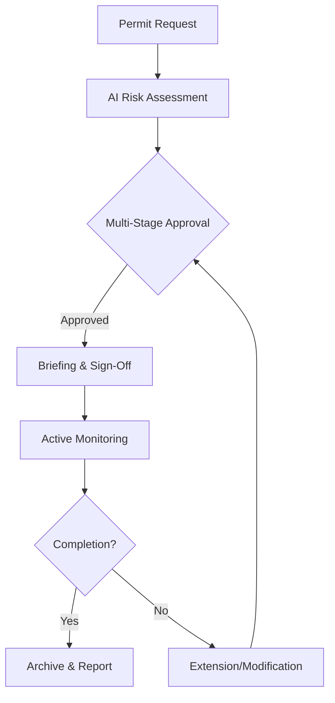

# Electronic Work Permit (EWP) Module Design Document

## 1. Introduction

The Electronic Work Permit (EWP) Module is a critical component of the Environmental, Health, and Safety (EHS) management system, designed to digitize and streamline the issuance, management, and monitoring of work permits. This module incorporates advanced technologies such as AI, IoT, and blockchain to enhance safety, compliance, and efficiency in hazardous work environments. The design prioritizes modularity, scalability, and adaptability to support organizations across various industries and regulatory frameworks.

Key objectives include:
- Automating permit lifecycles to reduce administrative burdens and errors.
- Integrating real-time monitoring and AI-driven risk assessments for proactive safety.
- Ensuring compliance with EHS standards through configurable workflows and audit trails.
- Providing intuitive interfaces for users of all technical levels, with robust accessibility and responsiveness.
- Supporting customization for diverse organizational needs, including integrations with enterprise systems.

This document outlines the architectural, UI/UX, technical, and operational specifications of the EWP Module, grounded in best practices for software engineering and EHS management.

## 2. Architectural Overview

### System Components
The EWP Module employs a microservices architecture to promote resilience and independent scalability. Key components include:
- **Permit Creation Service**: Handles permit requests, type selection, and initial risk assessments.
- **Approval Workflow Service**: Manages multi-stage approvals, quorum rules, and parallel processing.
- **Monitoring Service**: Tracks active permits via IoT, geofencing, and real-time updates.
- **LOTO Service**: Oversees Lock Out Tag Out procedures with 3D visualization and RFID tracking.
- **SIMOPS Service**: Detects conflicts, assesses risks, and coordinates simultaneous operations.
- **Checklist Service**: Manages pre-work, during-work, and post-work checklists with AI weighting.
- **Analytics Service**: Provides permit history, predictive analytics, and reporting.
- **Integration Gateway**: Facilitates connections with external systems like ERP, HR, IoT, and weather APIs.
- **Emergency Response Service**: Triggers notifications and integrates with response teams.

### Data Flows
Data flows are event-driven for real-time responsiveness:
1. Permit request submitted with job details, triggering AI risk pre-assessment.
2. Approval events cascade through configurable workflows, with notifications and escalations.
3. IoT sensors feed real-time data for monitoring, gas testing, and anomaly detection.
4. LOTO and SIMOPS data synchronize for equipment isolation and conflict resolution.
5. Completion events archive permits and generate compliance reports.
6. All data is encrypted and stored in a hybrid database, with blockchain for immutable logs.

### Integration Points
- **Enterprise Systems**: APIs for ERP, HR, CRM, and IoT devices to sync master data and real-time feeds.
- **Regulatory Databases**: Automated checks for compliance standards and permit requirements.
- **AI/ML Services**: For risk assessments, anomaly detection, and predictive analytics.
- **Blockchain**: Ensures tamper-proof audit trails for approvals and changes.
- **External APIs**: Weather services, gas sensors, and emergency response systems.

### Microservices Architecture
Services are containerized using Docker and orchestrated with Kubernetes, enabling horizontal scaling. Inter-service communication uses RESTful APIs, GraphQL for flexible queries, and event buses like Apache Kafka for asynchronous processing.

### Event-Driven Design Patterns
- **Event Sourcing**: Logs all permit changes as events for full traceability.
- **CQRS**: Separates read and write operations to optimize query performance.
- **Saga Pattern**: Coordinates complex workflows across services, handling failures gracefully.

## 3. UI/UX Specifications

### Design Principles
- **Aesthetics**: Beautiful, modern interfaces using Material Design, with clean typography, intuitive icons, and a cohesive color scheme emphasizing safety (greens and blues).
- **Accessibility**: WCAG 2.1 AA compliant, including screen reader support, keyboard navigation, high contrast ratios, and alternative text for images.
- **Responsiveness**: Adaptive layouts for desktop, tablet, and mobile using CSS Grid and Flexbox, ensuring seamless experiences across devices.
- **User-Centric**: Progressive disclosure for complex forms, contextual tooltips, and guided tutorials to assist non-technical users.

### Wireframes
Wireframes developed in Figma include:
- Permit Request Form: Dropdowns for types, hazards, PPE; AI-assisted fields.
- Approval Dashboard: Workflow stages, parallel approvals, and status tracking.
- Real-Time Permit Board: Visual map of active permits with AR overlays.
- LOTO Planning Interface: 3D equipment visualization and step checklists.

Example ASCII Wireframe for Permit Request:
```
+-----------------------------+
| Work Permit Request         |
+-----------------------------+
| Type: [Dropdown]            |
| Location: [Map Selector]    |
| Hazards: [Multi-Select]    |
| AI Risk: [Auto-Fill Score]  |
| Submit: [Button]            |
+-----------------------------+
```

### Mockups
High-fidelity mockups feature professional designs with interactive elements, such as drag-and-drop for checklists and real-time status badges.

### Interactive Prototypes
Prototypes in Adobe XD demonstrate full workflows, including permit creation, approval simulations, and emergency alerts, with voice command integration for field use.

## 4. Navigation and Workflows

### Navigation Structure
- **Main Menu**: Dashboard, Permits, LOTO, SIMOPS, Checklists, Analytics, Settings.
- **Breadcrumb Navigation**: For permit details and sub-workflows.
- **Global Search**: Filters by permit ID, location, or status.
- **Voice Commands**: For hands-free navigation in field environments.

### Workflows
- **Permit Lifecycle**: Request → AI Assessment → Multi-Stage Approval → Briefing → Monitoring → Completion/Closure.
- **LOTO Process**: Planning → Isolation Checklist → Verification → Release.
- **SIMOPS Coordination**: Conflict Detection → Risk Assessment → Approval → Monitoring.
- **Checklist Execution**: Pre-Work → During-Work (timed) → Post-Work with AI validation.
- **Emergency Response**: Trigger alerts → Notify teams → Log incidents.

Workflows align with EHS standards, using progressive disclosure and contextual help for intuitive use.

## 5. Customizable Features

- **Configurable Dashboards**: Drag-and-drop widgets for permit boards, analytics, and alerts.
- **Role-Based Access Controls**: Fine-grained permissions (e.g., request for workers, approve for supervisors).
- **Multi-Language Support**: Real-time translation with locale-specific date formats and compliance texts.
- **Integrations**: API endpoints and webhooks for ERP, HR, IoT sensors, CRM, and weather APIs.

## 6. Technical Details

### API Endpoints
- **RESTful APIs**: `/api/permits` (CRUD), `/api/loto/{id}/verify`, `/api/simops/conflicts`.
- **GraphQL**: For dynamic queries, e.g., `{ permits(location: "SiteA") { status, risks } }`.

### Database Schemas
- **Relational (PostgreSQL)**: Tables for permits, approvals, checklists, and user roles.
- **NoSQL (MongoDB)**: For unstructured data like IoT logs, photos, and blockchain hashes.

### Security Protocols
- **Encryption**: End-to-end AES-256 for data transmission and storage.
- **Authentication**: OAuth 2.0 with JWT and multi-factor authentication.
- **Compliance**: GDPR/CCPA with data minimization; zero-trust architecture with network segmentation.

### Scalability Considerations
- **Cloud-Native Deployment**: Kubernetes on AWS/Azure/GCP for auto-scaling and multi-region support.
- **Load Balancing**: Nginx or AWS ALB for distributing requests.

### Performance Benchmarks
- Load testing for 10,000+ concurrent users, targeting <1.5s response times for permit queries.
- Metrics: Throughput (requests/sec), latency, and error rates under peak loads.

### DevOps Practices
- **CI/CD Pipelines**: Automated builds and deployments using Jenkins or GitHub Actions.
- **Monitoring**: ELK stack for logs, Prometheus for metrics, and Grafana for dashboards.

## 7. User Personas, Use Cases, and Workflow Diagrams

### User Personas
- **Field Worker**: Requests permits, completes checklists; needs simple, mobile-friendly interfaces.
- **Safety Supervisor**: Approves permits, monitors risks; requires dashboards and alerts.
- **EHS Manager**: Oversees analytics, customizes workflows; focuses on compliance and reporting.
- **Contractor**: Accesses permits via portal; needs self-service and training.

### Use Cases
- **Issuing a Hot Work Permit**: Worker selects type → AI assesses risks → Supervisor approves → Monitoring activates.
- **Handling SIMOPS Conflict**: System detects overlap → Assesses combined risks → Escalates for approval.
- **Emergency During Permit**: IoT triggers alert → Response team notified → Permit paused and logged.

### Workflow Diagrams


## 8. Testing and Validation Plans

### Usability Testing
- Scripts for scenarios like requesting a permit in <5 minutes or completing LOTO in hazardous conditions.
- Metrics: Task completion rates >95%, time-to-completion <10 minutes, NPS >8.

### Automated Tests
- Unit tests for services (e.g., risk scoring algorithms).
- Integration tests for API interactions and event flows.
- Accessibility audits using tools like Lighthouse and WAVE.

### Performance Tests
- Load tests simulating 10,000+ users with concurrent permit requests.
- Stress tests for IoT data spikes and emergency scenarios.

### Validation Metrics
- Intuitiveness: User error rates <5%, help requests minimal.
- Efficiency: Workflow completion times reduced by 30% vs. manual processes.
- Satisfaction: Post-use surveys and A/B testing for UI improvements.