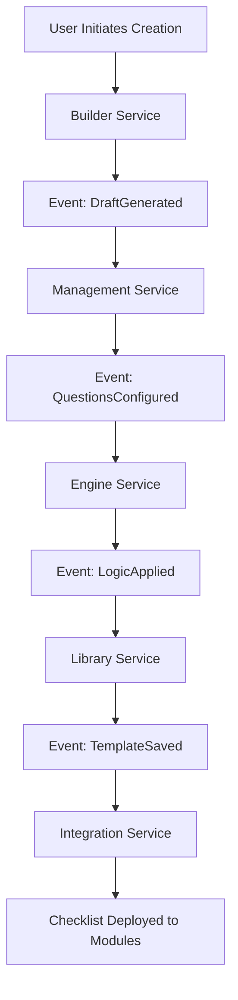
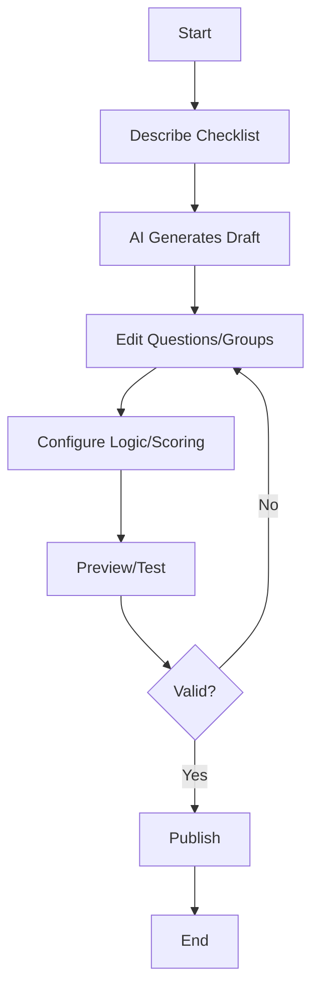

# Checklist Creation Module Design Document

## Introduction

The Checklist Creation Module is a centralized checklist builder that serves all other modules within the Environmental, Health, and Safety (EHS) management system with flexible, reusable checklists. It incorporates AI-assisted checklist generation from natural language descriptions, template cloning, and dynamic adaptations for cross-module compatibility. This module ensures that checklists are modular, scalable, and adaptable to any organization's size, industry, or regulatory needs, with built-in support for AI-driven insights, predictive analytics, and ethical data practices.

Key objectives include:
- Enabling the creation of complex checklists with hierarchical question groups, diverse question types, and conditional logic.
- Supporting module assignment, multi-module use, and version control for checklists.
- Providing customizable features like configurable dashboards, role-based access, and multi-language support.
- Ensuring high standards of UI/UX with accessibility, responsiveness, and intuitive workflows.
- Maintaining robust technical foundations including secure APIs, scalable databases, and DevOps practices.
- Facilitating real-world EHS scenarios through user personas, use cases, and workflow diagrams.
- Validating the module through comprehensive testing plans.

This design document outlines the architectural, UI/UX, technical, and operational aspects of the module, ensuring alignment with EHS best practices and support for emerging technologies.

## Architectural Overview

### System Components
The Checklist Creation Module adopts a microservices architecture to promote modularity, scalability, and resilience. Key components include:
- **Checklist Builder Service**: Manages the creation, editing, and publishing of checklists, including AI-assisted generation.
- **Question Management Service**: Handles question types, properties, and hierarchical structures.
- **Scoring Engine Service**: Processes scoring models, conditional logic, and calculations.
- **Template Library Service**: Stores, retrieves, and clones checklist templates with usage analytics.
- **Version Control Service**: Tracks changes, maintains historical versions, and supports rollback.
- **Integration Service**: Facilitates cross-module compatibility and external system integrations.
- **Analytics Service**: Provides AI-driven insights, predictive maintenance, and recommendation engines.
- **User Management Service**: Manages roles, permissions, and user attribution.
- **Notification Service**: Sends alerts for reviews, approvals, and updates.

### Data Flows
Data flows through the system in a structured, event-driven manner:
1. User inputs natural language descriptions; AI generates checklist drafts in the Builder Service.
2. Questions and groups are configured and stored in the Management Service.
3. Conditional logic and scoring are applied via the Engine Service.
4. Completed checklists are saved as templates in the Library Service.
5. Versions are tracked in the Control Service.
6. Checklists are deployed to other modules through the Integration Service.
7. Analytics monitor usage and suggest improvements.

### Integration Points
The module integrates seamlessly with:
- Internal EHS modules (Audit, Permit, Inspection, Compliance) for checklist deployment.
- Enterprise systems like ERP, HR, CRM for data synchronization.
- IoT devices for real-time data in checklists (e.g., sensor readings).
- External APIs for dynamic options and AI services.
- Blockchain for secure versioning and audit trails.

### Microservices Architecture
Each service is independently deployable using Docker containers orchestrated by Kubernetes. Services communicate via RESTful APIs, GraphQL, and message queues for loose coupling and scalability.

### Event-Driven Design Patterns
The system employs event-driven patterns for resilience and real-time updates:
- Events such as "ChecklistCreated" or "QuestionUpdated" trigger cascading updates across services.
- Message brokers like Kafka handle asynchronous processing, ensuring decoupling and fault tolerance.
- Saga patterns manage complex workflows, such as checklist approval chains.

## UI/UX Specifications

### Design Principles
The UI follows Material Design principles, emphasizing beautiful, modern aesthetics, intuitive interactions, and accessibility. Designs prioritize user experience for varying technical expertise through progressive disclosure and contextual help.

### Wireframes and Mockups
- **Checklist Builder Wireframe**: Hierarchical tree view for question groups with drag-and-drop reordering.
- **Question Editor Mockup**: Form-based interface for configuring question types, properties, and options.
- **Scoring Configuration Mockup**: Visual builder for scoring models with flowchart previews.
- **Template Library Mockup**: Grid view with search, filters, and clone functionality.
- Interactive prototypes in Figma or Adobe XD demonstrate workflows like AI generation and conditional rendering.

### Accessibility
- Full compliance with WCAG 2.1 AA standards.
- Support for screen readers (e.g., JAWS, NVDA) with ARIA labels and semantic HTML.
- Keyboard navigation for all elements, including shortcuts for power users.
- High color contrast (4.5:1 minimum) and support for high-contrast modes.
- Alternative text for images, icons, and multimedia; resizable text without loss of functionality.

### Responsiveness
- Adaptive layouts using CSS Grid and Flexbox for desktop, tablet, and mobile.
- Breakpoints: Desktop (>1024px), tablet (768-1023px), mobile (<768px).
- Touch-friendly interfaces with swipe gestures for navigation and drag-and-drop on mobile.
- Progressive enhancement ensures core functionality on low-bandwidth devices.

### Frameworks
- Primary: Material UI for React-based components, ensuring consistency and theming.
- Alternatives: Fluent UI for integrations with Microsoft ecosystems.

## Navigation and Workflows

### Intuitive Navigation
- **Top Navigation Bar**: Search bar, notifications, user profile, and quick access to recent checklists.
- **Sidebar Menu**: Collapsible sections for Builder, Templates, Versions, Analytics, and Settings.
- **Breadcrumb Navigation**: For nested pages like editing sub-groups.
- Progressive disclosure reveals advanced options (e.g., conditional logic) as needed.

### Workflows
- **Checklist Creation Workflow**: User describes via natural language → AI generates draft → Edit questions/groups → Configure scoring/logic → Preview → Publish.
- **Template Cloning Workflow**: Browse library → Select template → Customize → Save as new version.
- **Version Control Workflow**: View history → Compare versions → Rollback if needed.
- Alignment with EHS processes: Supports incident reporting (e.g., dynamic checklists based on incident type), hazard assessments, compliance tracking, and audit management.
- User assistance: Tooltips, inline help, guided tutorials, and AI-powered suggestions for question phrasing.

## Customizable Features

### Configurable Dashboards
- Drag-and-drop widgets: Checklist usage stats, AI insights, pending reviews, and module-specific metrics.
- Role-based views: Administrators see system-wide analytics; creators see personal drafts.

### Role-Based Access Controls
- Fine-grained permissions: Create, edit, review, approve, delete for checklists and templates.
- Integration with LDAP/Active Directory; support for custom roles like "Checklist Auditor".

### Multi-Language Support
- Real-time translation via APIs (e.g., Google Translate); support for 20+ languages including RTL.
- Localization for question text, options, and help content.

### Seamless Integrations
- API endpoints for syncing with ERP/HR data (e.g., pull employee lists for options).
- Webhooks for real-time updates (e.g., new regulation triggers checklist review).
- IoT integration for dynamic checklists (e.g., sensor data populates numeric fields).

## Technical Details

### API Endpoints
- **RESTful APIs**:
  - GET /api/checklists: Retrieve checklist list.
  - POST /api/checklists: Create new checklist.
  - PUT /api/checklists/{id}/questions: Add questions.
  - DELETE /api/checklists/{id}: Delete checklist.
- **GraphQL**: Flexible queries for complex data, e.g., checklists with nested questions and logic.

### Database Schemas
- **Relational (PostgreSQL)**: For structured data like checklists, questions, users.
  - Tables: Checklists, Questions, Groups, Versions, Scores.
- **NoSQL (MongoDB)**: For unstructured data like templates, attachments, AI-generated content.
  - Collections: Templates, Attachments, AnalyticsData.

### Security Protocols
- End-to-end encryption (TLS 1.3) for data in transit and AES-256 at rest.
- OAuth 2.0 and OpenID Connect for authentication.
- GDPR/CCPA compliance with data minimization, consent, and anonymization.
- Zero-trust architecture: Micro-segmentation, continuous monitoring, and least-privilege access.

### Scalability Considerations
- Cloud-native deployment on AWS/Azure/GCP with Kubernetes for auto-scaling.
- Horizontal scaling for services during high-usage periods (e.g., mass checklist updates).

### Performance Benchmarks
- Load testing for 10,000+ users: API response times <1s; throughput 2000 requests/second.
- Optimized for large checklists (1000+ questions) with lazy loading and caching.

### DevOps Practices
- CI/CD pipelines using GitHub Actions/Jenkins: Automated testing, linting, building, and deployment.
- Monitoring with ELK stack (Elasticsearch, Logstash, Kibana) and Prometheus for metrics.
- Infrastructure as Code with Terraform for reproducible environments.

## User Personas, Use Cases, and Workflow Diagrams

### User Personas
- **EHS Administrator**: Oversees checklist creation; needs advanced configuration and analytics.
- **Safety Officer**: Builds checklists for audits; requires intuitive tools and templates.
- **Compliance Manager**: Reviews and approves checklists; focuses on regulatory alignment.
- **Field Worker**: Uses checklists in inspections; needs simple, offline-capable interfaces.

### Use Cases
- **UC1: AI-Generated Checklist**: User inputs "Hazard assessment for chemical storage"; AI creates draft with questions on PPE, signage, etc.
- **UC2: Conditional Logic Application**: In an audit checklist, answering "Yes" to "Hazard present?" reveals additional risk questions.
- **Edge Case**: Offline editing; sync resolves conflicts on reconnection.
- **Failure Mode**: Invalid logic chain; system alerts and suggests corrections.

### Workflow Diagrams
Using BPMN notation via Mermaid:

## Testing and Validation Plans

### Usability Testing
- Scripts: 10 tasks per user, e.g., "Create a checklist with conditional questions."
- Metrics: Completion rate >95%, time-to-completion <10 minutes for complex checklists.

### Automated Tests
- Unit Tests: For services like scoring calculations.
- Integration Tests: End-to-end creation to deployment in modules.

### Accessibility Audits
- Tools: Lighthouse, Axe; quarterly audits ensuring WCAG compliance.

### Performance Load Tests
- Simulate 10,000 users creating checklists; measure latency (<2s) and resource usage.

### Metrics
- Intuitiveness: Task completion rates and error rates.
- Workflow Efficiency: Time-to-completion for creation workflows.
- User Satisfaction: NPS from surveys post-use.