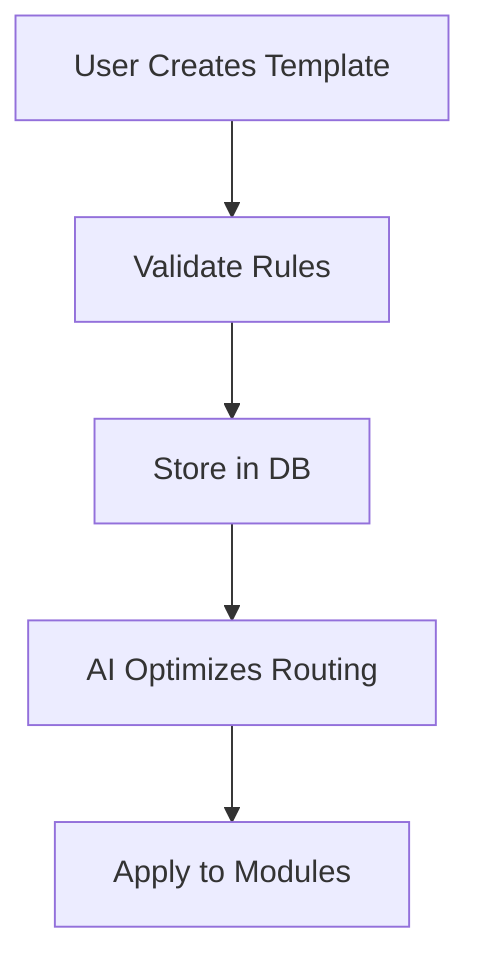

# Configuration Module Design Document

## 1. Introduction

The Configuration Module is a critical component of the EHS management system, enabling organizations to customize and manage approval workflows, escalation matrices, and cross-module integrations. This module ensures modularity, scalability, and adaptability to diverse organizational needs, incorporating AI-driven insights, predictive analytics, and ethical data practices. The design prioritizes user-centric features, robust security, and seamless integration with existing enterprise systems.

## 2. Architectural Overview

### System Components
- **Frontend Layer**: React-based UI with Material Design components for responsive, accessible interfaces.
- **Backend Layer**: Microservices architecture using Node.js/Express for API services, with event-driven communication via Kafka.
- **Database Layer**: Hybrid schema with PostgreSQL for relational data (e.g., templates, users) and MongoDB for NoSQL flexibility (e.g., dynamic configurations).
- **Integration Layer**: API Gateway for RESTful/GraphQL endpoints, supporting webhooks and event streaming.
- **AI/ML Layer**: Integrated TensorFlow/PyTorch models for predictive analytics, hosted on Kubernetes for scalability.

### Data Flows
- User inputs configurations via UI → Backend validates and stores in database → AI models analyze for optimizations → Notifications sent via event-driven triggers.
- Cross-module data flows through a centralized event bus, ensuring real-time updates and resilience.

### Integration Points
- ERP/HR/CRM systems via APIs and ETL pipelines.
- IoT devices for real-time data ingestion.
- Blockchain for immutable audit logs.

### Microservices Architecture
- **Approval Service**: Manages templates and workflows.
- **Escalation Service**: Handles rules and notifications.
- **Integration Service**: Manages cross-module data and APIs.
- **AI Service**: Provides predictive insights and automation.

### Event-Driven Design Patterns
- Publish-Subscribe pattern for notifications and escalations.
- Saga pattern for complex workflows to ensure consistency across services.

## 3. UI/UX Specifications

### Design Principles
- **Aesthetics**: Modern, clean design with Material Design 3.0, featuring subtle animations and high-contrast themes.
- **Accessibility**: WCAG 2.1 AA compliant, with screen reader support, keyboard navigation, and color contrast ratios >4.5:1.
- **Responsiveness**: Adaptive layouts using CSS Grid/Flexbox, optimized for desktop (1920px+), tablet (768-1024px), and mobile (<768px).

### Wireframes and Mockups
- **Approval Template Management**: Wireframe showing template creation form with drag-and-drop levels; Mockup with interactive approval flow visualization.
- **Escalation Matrix**: Wireframe for rule configuration; Mockup with real-time escalation dashboard.

### Interactive Prototypes
- Prototypes built in Figma/Adobe XD, demonstrating conditional routing and notification previews.

### Navigation and Workflows
- **Intuitive Navigation**: Sidebar menu with collapsible sections; Breadcrumb navigation for deep workflows.
- **Workflows**: Guided wizards for template creation, with progressive disclosure (e.g., advanced options hidden until needed). Contextual help via tooltips and embedded tutorials.

## 4. Customizable Features

### Configurable Dashboards
- Drag-and-drop widgets for KPIs, overdue items, and analytics; Role-based views (e.g., Executive dashboard shows high-level metrics).

### Role-Based Access Controls
- Fine-grained permissions (e.g., view-only for auditors, full edit for admins); Integration with LDAP/AD.

### Multi-Language Support
- Real-time translation via Google Translate API; RTL support for Arabic/Hebrew.

### Integrations
- API endpoints for ERP data sync; Webhooks for real-time alerts.

## 5. Technical Details

### API Endpoints
- RESTful: `/api/templates` (CRUD for approval templates).
- GraphQL: Query for complex escalation rules with nested data.

### Database Schemas
- Relational: `approval_templates` table with foreign keys to `users` and `modules`.
- NoSQL: JSON documents for dynamic configurations.

### Security Protocols
- End-to-end encryption with TLS 1.3; OAuth 2.0 for authentication; Zero-trust with JWT tokens; GDPR compliance via data anonymization.

### Scalability
- Kubernetes deployment with auto-scaling; Load balancing for 10,000+ users.

### Performance Benchmarks
- Response time <2s for queries; Load tests simulating 10,000 concurrent users.

### DevOps
- CI/CD with Jenkins/GitLab; Automated testing and blue-green deployments.

## 6. User Personas, Use Cases, and Workflow Diagrams

### User Personas
- **HSE Manager**: Tech-savvy, needs quick configurations.
- **Field Worker**: Low-tech, requires simple interfaces.

### Use Cases
- Creating an approval template for incident reports; Handling escalation for overdue audits.

### Workflow Diagrams

## 7. Testing and Validation Plans

### Usability Testing
- Scripts for task completion rates; A/B testing for UI variants.

### Automated Tests
- Unit tests for API logic; Integration tests for microservices.

### Accessibility Audits
- Axe tool for WCAG compliance.

### Performance Tests
- JMeter for load testing; Metrics: 99.9% uptime.

### Metrics
- Task completion rates >90%; NPS >7.

## 8. Conclusion

This design ensures a robust, user-friendly Configuration Module that supports EHS processes with AI and scalability. Future iterations will incorporate user feedback for enhancements.