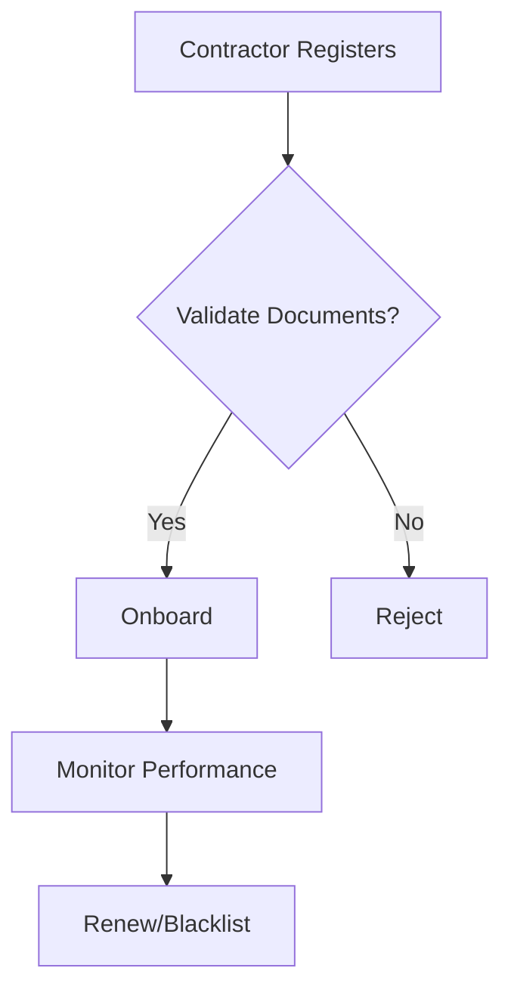

# Contractor Management Module Design Document

## 1. Introduction

The Contractor Management Module is a pivotal component of the Environmental, Health, and Safety (EHS) management system, designed to streamline the oversight, qualification, and monitoring of contractors within organizations. This module leverages emerging technologies such as AI, IoT, and blockchain to ensure comprehensive contractor lifecycle management, from registration to performance tracking. The design emphasizes modularity, scalability, and adaptability, catering to organizations of varying sizes, industries, and regulatory environments.

Key objectives include:
- Facilitating efficient contractor onboarding and qualification processes.
- Ensuring compliance with safety standards and regulatory requirements.
- Providing AI-driven insights for risk assessment and performance optimization.
- Enhancing user experience through intuitive interfaces and robust workflows.

This document details the architectural, UI/UX, technical, and operational aspects of the module, aligning with best practices in software design and EHS management.

## 2. Architectural Overview

### System Components
The Contractor Management Module adopts a microservices architecture for enhanced modularity and resilience. Core components include:
- **Contractor Registration Service**: Manages company profiles, key personnel, and initial data entry.
- **Pre-Qualification Service**: Handles document verification, compliance checks, and onboarding workflows.
- **Performance Monitoring Service**: Tracks safety metrics, incidents, and quality ratings.
- **Document Management Service**: Oversees expiry tracking, renewals, and version control.
- **Access Control Service**: Integrates with work permit systems for site authorization.
- **Contractor Portal Service**: Provides self-service capabilities for contractors.
- **Analytics Service**: Delivers AI-powered insights, predictive analytics, and reporting.
- **Integration Gateway**: Enables connections with external systems via APIs and webhooks.

### Data Flows
Data flows are event-driven to support real-time processing:
1. Contractor submits registration data via portal or API, triggering validation and storage.
2. Pre-qualification events initiate compliance checks and document scans.
3. Performance data is collected from incidents and IoT sensors, analyzed for anomalies.
4. Renewal alerts are generated based on expiry dates, with automated workflows.
5. All data is encrypted and stored in a hybrid database system.

### Integration Points
- **Enterprise Systems**: Seamless integration with ERP, HR, CRM, and IoT devices for data synchronization.
- **External Databases**: API-driven connections for real-time updates on certifications and regulatory data.
- **Regulatory Bodies**: Automated checks against licenses, permits, and compliance standards.
- **AI/ML Services**: For document scanning, fraud detection, and predictive forecasting.
- **Blockchain**: For immutable audit trails of contracts and certifications.

### Microservices Architecture
Services are containerized with Docker and orchestrated via Kubernetes, allowing independent scaling. Communication occurs through RESTful APIs, GraphQL, and message queues like RabbitMQ.

### Event-Driven Design Patterns
- **Event Sourcing**: Captures all changes as events for traceability.
- **CQRS**: Separates command and query operations for optimized performance.
- **Saga Pattern**: Manages distributed transactions across services, ensuring data consistency.

## 3. UI/UX Specifications

### Design Principles
- **Aesthetics**: Modern, visually appealing designs using Fluent UI, with emphasis on clean layouts, intuitive icons, and consistent color palettes.
- **Accessibility**: Full WCAG 2.1 AA compliance, supporting screen readers, keyboard navigation, high contrast modes, and alternative text.
- **Responsiveness**: Adaptive designs for desktop, tablet, and mobile, utilizing CSS Grid and Flexbox for fluid layouts.
- **User-Centric**: Progressive disclosure for complex forms, with contextual help and guided tutorials.

### Wireframes
Wireframes created in Figma include:
- Contractor Registration Form: Fields for company details, personnel, and documents.
- Dashboard: Overview of active contractors, performance metrics, and alerts.
- Competency Matrix: Grid view for skills tracking and gap analysis.

Example ASCII Wireframe for Contractor Portal:
```
+-----------------------------+
| Contractor Portal           |
+-----------------------------+
| Profile: [Edit Button]      |
| Documents: [Upload Area]    |
| Status: [Progress Bar]      |
| Chatbot: [Query Input]      |
+-----------------------------+
```

### Mockups
High-fidelity mockups feature professional typography (Segoe UI), color schemes (blues and greens for trust), and interactive elements.

### Interactive Prototypes
Prototypes in Adobe XD simulate workflows, including form auto-fill via AI and real-time status updates.

## 4. Navigation and Workflows

### Navigation Structure
- **Main Menu**: Dashboard, Contractors, Onboarding, Monitoring, Documents, Settings.
- **Breadcrumb Navigation**: For nested pages like contractor details.
- **Global Search**: Filters by contractor name, status, or certifications.

### Workflows
- **Contractor Registration**: Input company profile → Upload documents → AI validation → Approval.
- **Pre-Qualification & Onboarding**: Verify compliance → Assign training → Track induction.
- **Performance Monitoring**: Collect metrics → Analyze incidents → Generate reports.
- **Document Management**: Monitor expiries → Send reminders → Renew automatically.
- **Access Control**: Link to work permits → Authorize entry → Log access.

Workflows incorporate progressive disclosure and contextual help for ease of use.

## 5. Customizable Features

- **Configurable Dashboards**: Drag-and-drop widgets for KPIs, contractor lists, and alerts.
- **Role-Based Access Controls**: Granular permissions (e.g., view for auditors, edit for managers).
- **Multi-Language Support**: Real-time translation with locale-specific formats.
- **Integrations**: API endpoints and webhooks for ERP, HR, IoT, and CRM systems.

## 6. Technical Details

### API Endpoints
- **RESTful APIs**: `/api/contractors` (CRUD), `/api/documents/{id}/renewal`.
- **GraphQL**: For complex queries, e.g., `{ contractors(status: ACTIVE) { id, performanceScore } }`.

### Database Schemas
- **Relational (PostgreSQL)**: Tables for contractors, personnel, documents.
- **NoSQL (MongoDB)**: For unstructured data like competency matrices and IoT sensor logs.

### Security Protocols
- **Encryption**: AES-256 for data in transit and at rest.
- **Authentication**: OAuth 2.0 with JWT.
- **Compliance**: GDPR/CCPA with anonymization; zero-trust with micro-segmentation.

### Scalability Considerations
- **Cloud Deployment**: Kubernetes on AWS/Azure for auto-scaling.
- **Load Balancing**: Distribute traffic for high concurrency.

### Performance Benchmarks
- Load testing for 10,000+ users, <2s response times.
- Metrics: Throughput, latency, error rates.

### DevOps Practices
- **CI/CD**: Automated pipelines with GitHub Actions.
- **Monitoring**: Prometheus and Grafana for observability.

## 7. User Personas, Use Cases, and Workflow Diagrams

### User Personas
- **Procurement Manager**: Oversees contractor selection, focuses on compliance.
- **Safety Officer**: Monitors performance and incidents.
- **Contractor Representative**: Uses portal for self-service.

### Use Cases
- **Registering a Contractor**: Manager inputs details → System validates → Approves.
- **Monitoring Performance**: AI detects anomalies → Alerts sent → Review initiated.

### Workflow Diagrams


## 8. Testing and Validation Plans

### Usability Testing
- Scripts for task completion, e.g., onboard a contractor in <10 minutes.
- Metrics: Completion rate >90%, NPS >7.

### Automated Tests
- Unit and integration tests for services.
- Accessibility audits with Axe.

### Performance Tests
- Load simulations for scalability.

### Validation Metrics
- Efficiency: Time-to-completion for workflows.
- Satisfaction: Post-use surveys.