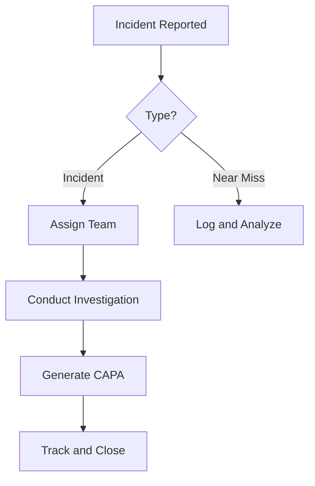

# Incident Management Module Design Document

## 1. Introduction

The Incident Management Module is a critical component of the Environmental, Health, and Safety (EHS) management system, designed to facilitate the reporting, investigation, and resolution of incidents within organizations. This module supports a comprehensive approach to incident handling, incorporating modern technologies such as AI, IoT, and blockchain to enhance efficiency, accuracy, and compliance. The design prioritizes modularity, scalability, and adaptability to meet the diverse needs of organizations across various industries and sizes.

Key objectives include:
- Streamlining incident reporting and management processes.
- Ensuring compliance with regulatory standards.
- Providing actionable insights through AI-driven analytics.
- Promoting a culture of safety through user-friendly interfaces and robust workflows.

This document outlines the architectural, UI/UX, technical, and operational aspects of the module, ensuring alignment with best practices in software design and EHS management.

## 2. Architectural Overview

### System Components
The Incident Management Module is built on a microservices architecture, comprising the following core components:
- **Incident Reporting Service**: Handles the creation and submission of incident reports.
- **Investigation Service**: Manages the investigation process, including team assignment and root cause analysis.
- **CAPA Management Service**: Oversees Corrective and Preventive Actions (CAPA) linked to incidents.
- **Data Analytics Service**: Provides AI-driven insights and predictive analytics.
- **Integration Gateway**: Facilitates connections with external systems via APIs and webhooks.
- **User Management Service**: Handles authentication, authorization, and role-based access controls.
- **Notification Service**: Manages alerts, reminders, and communications.

### Data Flows
Data flows through the system in an event-driven manner:
1. Incident reports are submitted via the UI or API, triggering validation and storage.
2. Upon submission, events are published to initiate investigation workflows.
3. Investigation data is collected and analyzed, generating CAPA recommendations.
4. Analytics services process historical data to provide insights and predictions.
5. All data is encrypted and stored in a hybrid relational/NoSQL database.

### Integration Points
- **Enterprise Systems**: Integration with ERP, HR, CRM, and IoT devices via RESTful APIs and webhooks.
- **Third-Party Tools**: Support for AI models, blockchain for audit trails, and external analytics platforms.
- **Regulatory Compliance**: Automated checks against standards like OSHA, GDPR, and CCPA.

### Microservices Architecture
Each service is independently deployable, communicating via RESTful APIs or message queues (e.g., RabbitMQ). This ensures resilience, with services scaling horizontally based on demand.

### Event-Driven Design Patterns
- **Event Sourcing**: All changes are stored as events for auditability.
- **CQRS (Command Query Responsibility Segregation)**: Separates read and write operations for performance.
- **Saga Pattern**: Manages complex workflows across services, ensuring consistency.

## 3. UI/UX Specifications

### Design Principles
- **Aesthetics**: Modern, clean design using Material Design principles, with a focus on visual hierarchy and intuitive layouts.
- **Accessibility**: WCAG 2.1 AA compliance, including support for screen readers, keyboard navigation, high color contrast, and alternative text for images.
- **Responsiveness**: Adaptive layouts for desktop, tablet, and mobile devices, using CSS Grid and Flexbox.
- **User-Centric**: Progressive disclosure to avoid overwhelming users, with contextual help and guided tutorials.

### Wireframes
Wireframes are created using tools like Figma or Balsamiq. Key screens include:
- Incident Reporting Form: Simple form with fields for type, description, location, and media upload.
- Dashboard: Grid layout with widgets for open incidents, trends, and quick actions.
- Investigation Page: Timeline view with sections for team, RCA tools, and CAPA linkage.

Example ASCII Wireframe for Incident Reporting:
```
+-----------------------------+
| Incident Reporting          |
+-----------------------------+
| Type: [Dropdown]            |
| Description: [Textarea]     |
| Location: [GPS/Map]         |
| Photos: [Upload]            |
| Submit [Button]             |
+-----------------------------+
```

### Mockups
High-fidelity mockups depict the final visual design, including color schemes (e.g., blue for primary actions), typography (Roboto font), and icons (Material Icons).

### Interactive Prototypes
Prototypes are built using tools like Adobe XD or InVision, allowing users to simulate workflows. For example, a prototype for incident reporting includes form validation feedback and AI auto-fill suggestions.

## 4. Navigation and Workflows

### Navigation Structure
- **Main Menu**: Dashboard, Reports, Investigations, CAPA, Settings.
- **Breadcrumb Navigation**: Contextual breadcrumbs for deep pages.
- **Search and Filters**: Global search with advanced filters by date, type, status.

### Workflows
- **Incident Reporting**: User selects type (Incident/Near Miss/Observation), fills form, submits. AI processes for auto-correction and categorization.
- **Investigation Workflow**: Assign team, conduct RCA using tools like Fishbone or 5 Whys, generate CAPA.
- **CAPA Workflow**: Plan actions, assign owners, track progress, verify effectiveness.
- **Gemba Walks**: Schedule inspections, use checklists, record observations with photo annotations.

Workflows incorporate progressive disclosure, showing only relevant fields based on selections, and provide guided tutorials for new users.

## 5. Customizable Features

- **Configurable Dashboards**: Drag-and-drop widgets for KPIs, charts, and alerts.
- **Role-Based Access Controls**: Fine-grained permissions (e.g., view-only for auditors, full edit for managers).
- **Multi-Language Support**: Real-time translation using APIs like Google Translate, with locale-specific formatting.
- **Integrations**: API endpoints for seamless data exchange with ERP, HR, IoT devices, and CRM systems.

## 6. Technical Details

### API Endpoints
- **RESTful APIs**: `/api/incidents` (GET, POST, PUT, DELETE), `/api/investigations/{id}/rca`.
- **GraphQL**: Flexible queries for complex data retrieval, e.g., `query { incidents(status: OPEN) { id, description } }`.

### Database Schemas
- **Relational (PostgreSQL)**: Tables for incidents, users, teams.
- **NoSQL (MongoDB)**: Flexible storage for unstructured data like witness statements and media.

### Security Protocols
- **Encryption**: End-to-end AES-256 for data in transit and at rest.
- **Authentication**: OAuth 2.0 with JWT tokens.
- **Compliance**: GDPR/CCPA with data anonymization, zero-trust architecture with micro-segmentation.

### Scalability Considerations
- **Cloud-Native Deployment**: Kubernetes orchestration for auto-scaling.
- **Load Balancing**: Nginx for distributing traffic.

### Performance Benchmarks
- Load testing for 10,000+ concurrent users, targeting <2s response times.
- Metrics: Throughput (requests/sec), latency, error rates.

### DevOps Practices
- **CI/CD Pipelines**: GitHub Actions for automated testing, building, and deployment.
- **Monitoring**: Prometheus for metrics, Grafana for dashboards.

## 7. User Personas, Use Cases, and Workflow Diagrams

### User Personas
- **Safety Officer**: Tech-savvy, focuses on compliance and reporting.
- **Field Worker**: Mobile user, needs quick reporting tools.
- **Manager**: Oversees workflows, requires dashboards and analytics.

### Use Cases
- **Reporting a Near Miss**: Worker uses mobile app to report with GPS and photo, AI categorizes it.
- **Conducting RCA**: Investigator uses Fishbone diagram to identify causes, links to CAPA.

### Workflow Diagrams


## 8. Testing and Validation Plans

### Usability Testing
- Scripts for task completion rates, e.g., "Report an incident in under 5 minutes."
- Metrics: Task completion rate >90%, user satisfaction NPS >7.

### Automated Tests
- Unit tests for services, integration tests for APIs.
- Accessibility audits using Axe or Lighthouse.

### Performance Tests
- Load tests simulating peak usage.

### Validation Metrics
- Workflow efficiency: Average time-to-completion <24 hours.
- Intuitiveness: Low error rates in forms.