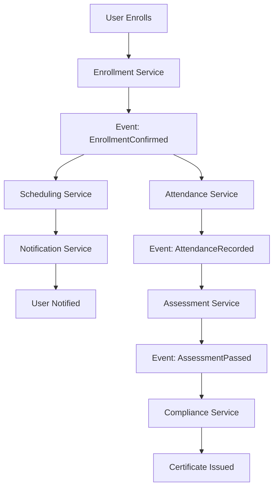
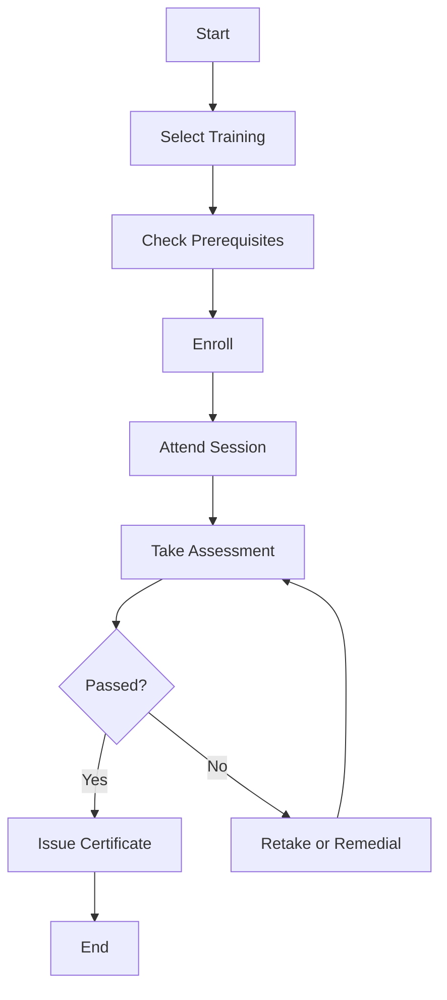

# Training Management Module Design Document

## Introduction

The Training Management Module is a core component of the Environmental, Health, and Safety (EHS) management system, designed to streamline the administration, delivery, and tracking of training programs across organizations. This module ensures compliance with regulatory standards, enhances employee competencies, and supports continuous improvement in safety and health practices. Leveraging emerging technologies such as AI, IoT, and blockchain, the module provides predictive analytics, automated workflows, and secure certification management.

Key objectives include:
- Facilitating comprehensive training lifecycle management from content creation to certification.
- Ensuring adaptability to diverse organizational needs through customization and integration.
- Promoting user-friendly interfaces that cater to varying technical expertise levels.
- Maintaining high standards of security, scalability, and ethical data practices.

This design document outlines the architectural, UI/UX, technical, and operational aspects of the module, ensuring it aligns with EHS best practices and supports real-world scenarios.

## Architectural Overview

### System Components
The Training Management Module adopts a microservices architecture to promote modularity, scalability, and resilience. Key components include:
- **Training Content Service**: Manages creation, storage, and versioning of training materials.
- **Scheduling Service**: Handles calendar management, session definitions, and conflict resolution.
- **Enrollment Service**: Oversees user registrations, waitlists, and notifications.
- **Attendance Service**: Tracks check-ins, partial attendance, and reporting.
- **Assessment Service**: Builds and administers tests, evaluates results, and manages certifications.
- **Compliance Service**: Monitors training records, expiry alerts, and compliance reporting.
- **Analytics Service**: Provides insights on completion rates, skills gaps, and ROI.
- **User Management Service**: Integrates with HR systems for role-based access and user profiles.
- **Notification Service**: Sends personalized, multi-channel alerts.
- **Integration Gateway**: Facilitates connections with external systems via APIs and webhooks.

### Data Flows
Data flows through the system in a structured manner:
1. Content creation and upload trigger storage in the Content Library.
2. Scheduling events generate calendar entries and notify potential attendees.
3. Enrollment data flows to Attendance and Assessment services.
4. Assessment results update Compliance and Analytics services.
5. Reports and alerts are generated and distributed via the Notification Service.

### Integration Points
The module integrates seamlessly with:
- Enterprise Resource Planning (ERP) systems for workforce data.
- Human Resources (HR) systems for employee profiles and competencies.
- IoT devices for real-time training data (e.g., VR/AR simulations).
- Customer Relationship Management (CRM) for external trainer management.
- Video conferencing tools (e.g., Zoom, Teams) for virtual sessions.
- Blockchain networks for certificate verification.

### Microservices Architecture
Each service is independently deployable, communicating via RESTful APIs or message queues. For example:
- Services use Docker containers orchestrated by Kubernetes for scalability.
- API Gateway handles routing and load balancing.

### Event-Driven Design Patterns
The system employs event-driven patterns for resilience:
- Events like "TrainingCompleted" trigger notifications and compliance updates.
- Message brokers (e.g., Kafka) ensure asynchronous processing and decoupling.
- Saga patterns manage distributed transactions, such as enrollment-to-certification workflows.

## UI/UX Specifications

### Design Principles
The UI follows Material Design principles, emphasizing clean aesthetics, intuitive interactions, and accessibility. Mockups are created using tools like Figma or Adobe XD, with interactive prototypes in InVision or Framer.

### Wireframes and Mockups
- **Dashboard Wireframe**: Grid layout with widgets for upcoming trainings, completion rates, and alerts.
- **Training Calendar Mockup**: Interactive calendar with drag-and-drop scheduling.
- **Assessment Builder Mockup**: Form-based interface for creating questions with preview functionality.
- Prototypes include hover states, transitions, and user flows for enrollment and testing.

### Accessibility
- Compliance with WCAG 2.1 AA standards.
- Support for screen readers (e.g., JAWS, NVDA) with ARIA labels.
- Keyboard navigation for all interactive elements.
- High color contrast ratios (4.5:1 for normal text, 3:1 for large text).
- Alternative text for images and multimedia.

### Responsiveness
- Adaptive layouts using CSS Grid and Flexbox.
- Breakpoints for desktop (>1024px), tablet (768-1023px), and mobile (<768px).
- Touch-friendly interfaces on mobile with swipe gestures for navigation.

### Frameworks
- Primary: Material UI for React-based components.
- Alternatives: Fluent UI for Microsoft ecosystem integrations.

## Navigation and Workflows

### Intuitive Navigation
- **Top Navigation Bar**: Includes search, notifications, and user profile.
- **Sidebar Menu**: Collapsible with sections for Training, Scheduling, Compliance, etc.
- **Breadcrumb Navigation**: For deep pages like assessment details.
- Progressive disclosure hides advanced options until needed.

### Workflows
- **Training Scheduling Workflow**: User selects category → Defines session → Assigns trainer → Sets capacity → Publishes.
- **Enrollment Workflow**: User browses calendar → Enrolls → Receives confirmation → Attends → Completes assessment.
- **Certification Workflow**: Pass test → Generate certificate → Store in blockchain → Send notifications.
- Alignment with EHS processes: Integrates with incident reporting (e.g., post-incident training) and compliance tracking.

### User Assistance
- Contextual help tooltips and inline guides.
- Guided tutorials for new users, accessible via onboarding modals.
- Search functionality with AI-powered suggestions.

## Customizable Features

### Configurable Dashboards
- Drag-and-drop widgets: Charts for completion rates, skill gaps, trainer performance.
- Role-based views: Managers see analytics; employees see personal matrices.

### Role-Based Access Controls
- Fine-grained permissions: View, edit, approve for specific modules.
- Integration with LDAP/Active Directory for authentication.

### Multi-Language Support
- Real-time translation using APIs like Google Translate.
- Support for 20+ languages with RTL layouts.

### Seamless Integrations
- API endpoints for ERP/HR data sync.
- Webhooks for real-time updates (e.g., employee onboarding triggers training assignment).
- IoT integration for wearable device data in safety trainings.

## Technical Details

### API Endpoints
- **RESTful APIs**:
  - GET /api/trainings: Retrieve training list.
  - POST /api/trainings: Create new training.
  - PUT /api/trainings/{id}/enroll: Enroll user.
- **GraphQL**: Flexible queries for complex data retrieval, e.g., user training history with competencies.

### Database Schemas
- **Relational (PostgreSQL)**: For structured data like users, sessions, assessments.
  - Tables: Users, Trainings, Enrollments, Certificates.
- **NoSQL (MongoDB)**: For unstructured content like videos, documents.
  - Collections: ContentLibrary, AssessmentQuestions.

### Security Protocols
- End-to-end encryption for data in transit and at rest.
- OAuth 2.0 for authentication.
- GDPR/CCPA compliance with data anonymization and consent management.
- Zero-trust architecture: Continuous verification and micro-segmentation.

### Scalability Considerations
- Cloud-native deployment on AWS/Azure with Kubernetes auto-scaling.
- Horizontal scaling for services during peak loads (e.g., enrollment periods).

### Performance Benchmarks
- Load testing for 10,000+ concurrent users: Response time <2s for API calls.
- Throughput: 1000 requests/second per service.

### DevOps Practices
- CI/CD pipelines using Jenkins/GitLab CI: Automated testing, building, and deployment.
- Monitoring with Prometheus and Grafana for metrics and alerts.

## User Personas, Use Cases, and Workflow Diagrams

### User Personas
- **EHS Manager**: Oversees compliance; needs analytics and reporting.
- **Employee**: Participates in trainings; requires simple enrollment and tracking.
- **Trainer**: Creates content; manages sessions and assessments.
- **Auditor**: Reviews compliance; accesses reports and certificates.

### Use Cases
- **UC1: Schedule Training**: Manager defines session; system checks conflicts; notifies attendees.
- **UC2: Take Assessment**: Employee logs in; completes test; receives certificate if passed.
- **Edge Case**: Network failure during test; system saves progress and resumes.

### Workflow Diagrams
Using BPMN notation via Mermaid:

## Testing and Validation Plans

### Usability Testing
- Scripts: 10 tasks per user, e.g., "Enroll in a training session."
- Metrics: Task completion rate >90%, time-to-completion <5 minutes.

### Automated Tests
- Unit Tests: For service methods, e.g., enrollment logic.
- Integration Tests: End-to-end flows like enrollment to certification.

### Accessibility Audits
- Tools: WAVE, Axe; Annual audits for WCAG compliance.

### Performance Load Tests
- Simulate 10,000 users; measure latency and throughput.

### Metrics
- Intuitiveness: Task completion rates.
- Efficiency: Time-to-completion for workflows.
- Satisfaction: NPS scores from post-training surveys.